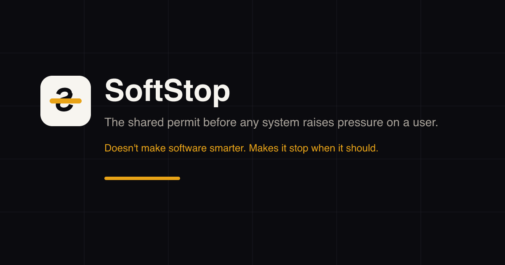
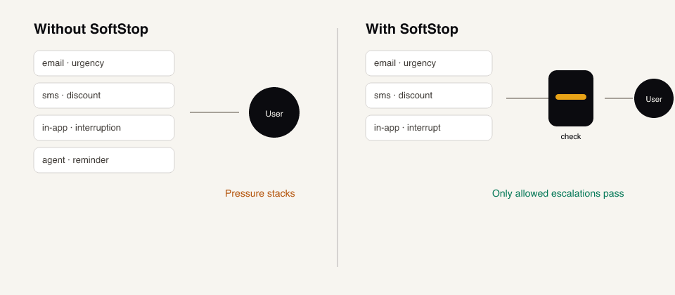

<p align="center">
  
</p>

<h1 align="center">SoftStop</h1>

<p align="center"><strong>The shared permit before any system raises pressure on a user.</strong></p>

<p align="center">Doesn't make software smarter. Makes it stop when it should.</p>

<p align="center">
  <a href="docs/README.md">Docs</a> ·
  <a href="#get-started">Quickstart</a> ·
  <a href="https://governer.vercel.app">Live demo</a> ·
  <a href="governor/README.md">API</a> ·
  <a href="examples/README.md">Examples</a> ·
  <a href="SECURITY.md">Security</a>
</p>

<p align="center">
  <a href="LICENSE"></a>
  <a href="package.json"></a>
  <a href="docker-compose.yml"></a>
  <a href="CHANGELOG.md"></a>
</p>

<p align="center">
  
</p>

<p align="center">
  
</p>

Scroll the full story (email, SMS, push, in-app stacking → SoftStop on): **[Live demo](https://governer.vercel.app)**

## Get started

Self-host first (under 5 minutes):

```bash
pnpm install
pnpm dev
```

```bash
# smoke-test
pnpm softstop verify

# check before escalating
curl -X POST http://localhost:3000/v1/check \
  -H 'content-type: application/json' \
  -d '{"userId":"user_123","actionType":"urgency","surface":"email"}'
```

Docker: `docker compose up --build`

## The contract

Authorize only — SoftStop does not send email, pick offers, or write copy.

```js
const base = process.env.SOFTSTOP_API_URL || "http://localhost:3000";
const check = await fetch(`${base}/v1/check`, {
  method: "POST",
  headers: { "content-type": "application/json" },
  body: JSON.stringify({ userId: "user_123", actionType: "urgency", surface: "email" })
}).then((r) => r.json());

if (!check.allowed) {
  await fetch(`${base}/v1/record`, {
    method: "POST",
    headers: { "content-type": "application/json" },
    body: JSON.stringify({
      decisionId: check.decisionId,
      userId: "user_123",
      actionType: "urgency",
      outcome: "blocked",
      blockReason: check.reason
    })
  });
  return;
}

// escalate, then record outcome: "executed"
```

> Hosted APIs use `/api` instead of `/v1`. `GOVERNOR_API_URL` is accepted as a legacy alias for `SOFTSTOP_API_URL`.

| actionType | Meaning |
|---|---|
| `urgency` | Time pressure |
| `discount` | Price / promo |
| `interruption` | Modal / popup |
| `reminder` | Soft nudge |

## When to use

- Many systems (lifecycle, pricing, UI, agents) can push the **same** user and don't share state
- Platform / marketplace agents collide with your own automations
- You need a tiny gate under Braze/Resend/modals — not another messaging platform or MCP tool firewall

## Adoption

SoftStop only protects users when every escalation touchpoint calls `check` and a matching `record`. Misuse creates false confidence.

- `POST /v1/verify` — integration smoke test
- `GET /v1/health` — orphan rate, block rate, health score

Details: [Adoption contract](docs/ADOPTION_CONTRACT.md)

## Examples

- [Node.js](examples/nodejs) · [Python](examples/python) · [Browser](examples/browser)
- [Agent touchpoint](examples/agent-touchpoint) — agent calls SoftStop before escalating a human
- [Scroll demo](demo/index.html) — the product story

## Docs

Start at the [docs hub](docs/README.md): concept, self-host, policy pack, integration workflow, API.

---

[Contributing](CONTRIBUTING.md) · [Security](SECURITY.md) · [Changelog](CHANGELOG.md) · [Adopters](ADOPTERS.md) · [Press](docs/press/SOFTSTOP_PRESS_RELEASE.md) · [License](LICENSE)
