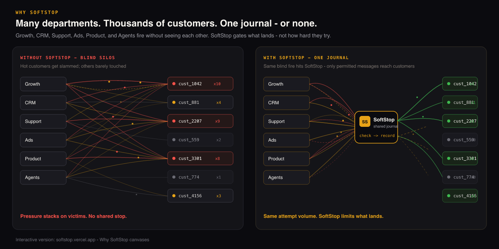

<p align="center">
  
</p>

<h1 align="center">SoftStop</h1>

<p align="center"><strong>The Circuit Breaker for Autonomous Agents and Customer Outreach.</strong></p>

<p align="center">Prevent rogue agents, growth loops, and background jobs from spamming your users—across every surface.</p>

<p align="center">Doesn't make software smarter. Makes it stop when it should.</p>

<p align="center">
  
</p>

<p align="center"><em>Growth, CRM, Support, Ads, Product, and Agents don’t share a stop signal — so a few customers accumulate pressure until they churn. SoftStop is the shared permit every system <code>check</code>s before anything lands.</em><br />
<a href="https://softstop.vercel.app">See the interactive Why SoftStop canvases →</a></p>

<p align="center">
  <a href="https://softstop-docs.vercel.app">Docs</a> ·
  <a href="#get-started">Quickstart</a> ·
  <a href="https://softstop.vercel.app">Live demo</a> ·
  <a href="https://softstop.vercel.app/console.html">See pressure live</a> ·
  <a href="governor/README.md">API</a> ·
  <a href="governor/api">Canonical runtime (`governor/api`)</a> ·
  <a href="examples/README.md">Examples</a> ·
  <a href="SECURITY.md">Security</a>
</p>

<p align="center">
  <a href="https://github.com/chonibe/SoftStop/actions/workflows/ci.yml"></a>
  <a href="LICENSE"></a>
  <a href="package.json"></a>
  <a href="docker-compose.yml"></a>
  <a href="CHANGELOG.md"></a>
</p>

<p align="center"><em>Early open source — looking for design partners. Not a claim of wide production adoption.</em></p>

## Why SoftStop?

- **Agent circuit breaking** — a safety layer in tool-calling loops, not just frequency capping. `check()` before the side effect; `record()` after.
- **Deterministic state for non-deterministic LLMs** — offload time/count cooldowns from the prompt. Policy and pressure live on the server.
- **Multi-agent collision prevention** — shared per-user permit across Onboarding / Sales / Support (and email / SMS / UI) on separate runtimes.
- **Graceful fallbacks** — when blocked, `suggestedActionType` steers the next move (e.g. interruption → reminder) instead of crash or retry loops.

Authorize only — SoftStop is not a CDP, not a messenger, not tool IAM. See [Governing AI Agents](apps/docs/start/governing-ai-agents.md).

## What SoftStop is

SoftStop answers one question before an escalation runs:

> Is it allowed to raise pressure on **this user**, with **this action type**, **right now**?

It does **not** rate-limit humans. It rate-limits the **actors** (agents, automations, messaging systems) that want to reach them.

It does **not** send email, write copy, pick offers, or replace Braze / Resend / your agents. Those systems still decide *what* to say. SoftStop decides whether they’re allowed to push.

| SoftStop does | SoftStop does not |
|---|---|
| `check` → allow or block | Send messages |
| `record` the outcome | Personalize content |
| Track **user pressure** (cost + decay + threshold) | Optimize conversion |
| Enforce cooldowns & caps across systems | MCP tool IAM / HITL approvals |

## Get started

### Install

```bash
npm i softstop
```

```bash
pip install softstop
```

Self-host the SoftStop API for production ([`governor/api`](governor/api) is the **canonical runtime**). [softstop.vercel.app](https://softstop.vercel.app) is the live demo and SDK CDN — not a production host. Platform / lifecycle eng typically runs the API; Growth, CRM, product, and agents call `check` / `record` at send time.

Experimental packages under `packages/core|server|storage|gateway` are **non-canonical** — see [`packages/NON_CANONICAL.md`](packages/NON_CANONICAL.md).

### Quick start — AI tool call

Prefer the shipped adapters (`beforeContact`, `wrapUserFacingTool`, `withSoftStop`). Outcomes are **`executed` | `blocked`** (not “landed”). On deny, `formatBlockedForLlm(decision)` (or `withSoftStop`) returns a stable JSON string for the model — including `suggestedFallback` / `retryAfterMs` when present.

```js
import { SoftStop, wrapUserFacingTool, withSoftStop } from 'softstop'

const ss = new SoftStop({ url: process.env.SOFTSTOP_API_URL || 'http://localhost:3000' })

const sendFollowUp = wrapUserFacingTool(
  ss,
  {
    userId: (args) => args.userId,
    actionType: 'urgency',
    surface: 'email',
    actor: 'sales-agent'
  },
  async ({ userId, subject }) => {
    // Resend / SMTP / …
    return { messageId: 'msg_1', userId, subject }
  }
)

const result = await sendFollowUp({ userId: 'user_123', subject: 'Quick follow-up' })

if (!result.ok) {
  // SoftStop already recorded outcome: 'blocked' (+ blockReason)
  // Steer the model — do not crash or retry the same actionType
  return {
    blocked: true,
    reason: result.reason,
    suggestedActionType: result.suggestedActionType // e.g. 'reminder'
  }
}
// SoftStop already recorded outcome: 'executed'
```

For Vercel AI SDK `tool({ execute })`, prefer `withSoftStop(fn, { client: ss, … })` — blocked paths return `formatBlockedForLlm` automatically.

Inline without wrapping:

```js
const gated = await ss.beforeContact(
  { userId: 'user_123', actionType: 'urgency', surface: 'email', actor: 'sales-agent' },
  () => sendEmail(/* … */)
)
if (!gated.allowed) {
  // gated.suggestedActionType — record already done with outcome: 'blocked'
}
```

Raw `check` / `record` (same contract):

```js
const decision = await ss.check({
  userId: 'user_123',
  actionType: 'urgency',
  surface: 'email'
})

if (!decision.allowed) {
  await ss.record({
    decisionId: decision.decisionId,
    userId: 'user_123',
    actionType: 'urgency',
    outcome: 'blocked',
    blockReason: decision.reason
  })
  return
}

// escalate, then:
await ss.record({
  decisionId: decision.decisionId,
  userId: 'user_123',
  actionType: 'urgency',
  outcome: 'executed'
})
```

```js
const status = await ss.getPressure('user_123')
// { pressure, threshold, decayPerHour, costs, updatedAt }
```

Alternates: `github:chonibe/SoftStop#path:packages/sdk-js` or `https://softstop.vercel.app/softstop.tgz`. Browser CDN: `https://softstop.vercel.app/sdk.js`.

### Self-host the API

One-liner (in-memory storage on port `3000`):

```bash
docker compose up --build
```

```bash
curl -X POST http://localhost:3000/v1/verify
```

Without Docker:

```bash
pnpm install
pnpm dev
pnpm softstop verify
```

Env: see [`.env.example`](.env.example) (`SOFTSTOP_*` / `GOVERNOR_*` aliases). Default image/compose uses `GOVERNOR_STORAGE=memory` — no database required. Add `SUPABASE_URL` + `SUPABASE_SERVICE_ROLE_KEY` for persistence ([self-host docs](apps/docs/self-host/)).

<p>
  <a href="https://railway.app/new/template?template=https://github.com/chonibe/SoftStop"></a>
  &nbsp;
  <a href="https://fly.io/launch/github.com/chonibe/SoftStop"></a>
</p>

CLI alternatives: `fly launch --copy-config` (uses [`fly.toml`](fly.toml)) · Railway detects [`Dockerfile`](Dockerfile) / [`railway.toml`](railway.toml).

**Latency (honest):** local memory `POST /v1/check` P95 ≈ **0.9 ms** on a 2026-08-07 loopback microbench (`pnpm bench:check`; n=500). Details: [docs/perf/PERFORMANCE.md](docs/perf/PERFORMANCE.md). No hosted/Supabase sub-10ms claim without data.

## CI

GitHub Actions runs `pnpm test:governor` on push/PR ([`.github/workflows/ci.yml`](.github/workflows/ci.yml)). Badge above links to the latest run.

## The contract

Authorize only — SoftStop does not send email, pick offers, or write copy. Prefer the SDK above; raw `fetch` to `/v1/check` + `/v1/record` is equivalent. Read live pressure with `GET /v1/users/:userId/pressure`.

> Hosted APIs use `/api` instead of `/v1`. `GOVERNOR_API_URL` is accepted as a legacy alias for `SOFTSTOP_API_URL`.

| actionType | Meaning | Default cost | Typical surface |
|---|---|---|---|
| `urgency` | Time pressure | 40 | “ends tonight” email / push |
| `discount` | Price / promo | 30 | SMS offer, coupon modal |
| `interruption` | Modal / popup | 25 | Checkout upsell, in-app dialog |
| `reminder` | Soft nudge | 15 | Agent follow-up, badge |

Custom types: add the same key to `costs`, `cooldownHours`, and `typeCap` in a policy file — see [action types](apps/docs/policies/action-types.md).

Default threshold: **100**. Default decay: **8** points/hour.

## When to use

- **Agents** — circuit breaker in tool loops; shared permit across Onboarding/Sales/Support ([Governing AI Agents](apps/docs/start/governing-ai-agents.md))
- **Marketing + CRM** — lifecycle, promo, and win-back tools don’t share caps with agents
- **Product UI** — modals/banners fire while email/SMS/agents are also pushing
- **Not SoftStop** — you need a messaging platform, CDP (identity/journey store), or MCP tool firewall. SoftStop only gates pressure; it does not replace a CDP.

## Adoption

SoftStop only protects users when every escalation touchpoint calls `check` and a matching `record`. Misuse creates false confidence.

- `POST /v1/verify` — integration smoke test
- `GET /v1/health` — orphan rate, block rate, health score

`orphanRate` measures `check`/`record` pairing on **observed** SoftStop traffic. Systems that never call SoftStop never appear in health — low orphan rate is not proof that every actor in the company is wired. Details: [Adoption contract](docs/ADOPTION_CONTRACT.md)

## Legacy names

Prefer SoftStop names (`SOFTSTOP_API_URL`, `SOFTSTOP_POLICY`, product docs under SoftStop). The HTTP engine still lives under `governor/`; `GOVERNOR_API_URL`, `GOVERNOR_POLICY`, and related aliases remain for backward compatibility. Do not remove them yet.

Repo note: root [`tenet-policy.json`](tenet-policy.json) configures **contributor** boundary lint (`scripts/tenet-check.js`). It is **not** a SoftStop pressure policy — runtime packs live in [`policies/`](policies/).

## Examples

- [**Agent + email collision**](examples/agent-email-collision) — sales agent email then marketing SMS; print pressure
- [**Agent tool wrapper**](examples/agent-tool-wrapper) — `wrapUserFacingTool` in a function-calling / tool loop
- [**LangChain agent (Python)**](examples/langchain-agent) — `pip install softstop` + `wrap_user_facing_tool`
- [**Governing AI agents**](apps/docs/start/governing-ai-agents.md) — circuit breaker, pillars, `suggestedActionType`
- [**Sample shop**](examples/sample-shop) — chaos vs SoftStop + orphan-rate health (`node index.js --mode=compare`)
- [Node.js](examples/nodejs) · [Python SDK](packages/sdk-python) · [Browser](examples/browser)
- [Agent touchpoint](examples/agent-touchpoint) — `beforeContact` before escalating a human
- [Scroll demo](https://softstop.vercel.app) — marketing-chaos example story
- [Pressure Console](https://softstop.vercel.app/console.html) — look up a user, watch the meter, simulate contacts
- [Before / after write-up](docs/BEFORE_AFTER.md)

## Docs

Start at the [docs hub](docs/README.md): concept, self-host, policy pack, integration workflow, API.

---

[Contributing](CONTRIBUTING.md) · [Security](SECURITY.md) · [Changelog](CHANGELOG.md) · [Adopters (invite)](ADOPTERS.md) · [License](LICENSE)

Press drafts (not customer proof): [Press](docs/press/SOFTSTOP_PRESS_RELEASE.md)
