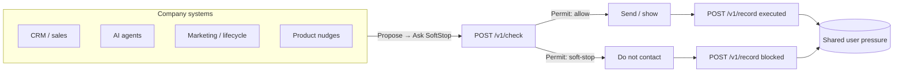

# How a company uses SoftStop

SoftStop is the **shared permission check** before any automated system contacts a customer. It is not a replacement for Braze, Salesforce, HubSpot, Twilio, Resend, or your agents. Those tools still compose and send. SoftStop only answers: *is this person allowed to receive more pressure right now?*

> **Organizational contract:** *Any automated system that wants to consume customer attention must obtain a SoftStop permit first.*

## The pipeline

Same loop on every surface — lifecycle email, sales SMS, support bot, product nudge, AI agent tool:

| Step | Plain English | Builder |
|---|---|---|
| **Propose** | Something wants to push this person | Campaign / agent / job is about to escalate |
| **Ask SoftStop** | Request a permit | `POST /v1/check` |
| **Permit** | Allow or soft-stop | `allowed: true` / `false` |
| **Act** | Send / show — or skip | ESP, UI, or tool runs only if allowed |
| **Close the loop** | Report what happened | `POST /v1/record` (`executed` or `blocked`) |

SoftStop is the permit. Your email provider (or modal, SMS, agent) still does the work.

## Many systems, one stop signal

Without SoftStop, CRM, marketing, product, and agents each keep their own notion of “enough.” They do not share a stop. SoftStop sits in the middle so pressure is shared.



Every path uses the **same SoftStop user id**. That is what makes pressure real across teams.

## Where to integrate

Wire `check` → act → `record` at every place that raises pressure on a person. Prefer the same identity everywhere.

| Surface | Typical systems | SoftStop role |
|---|---|---|
| Lifecycle / marketing | Braze, Customer.io, HubSpot journeys | Ask before each send; record after |
| Sales automation | Salesforce sequences, Outreach, custom CRM jobs | Gate urgency / discount outreach |
| Support bots | Intercom, Zendesk bots, in-app chat | Gate proactive interruptions |
| AI agents | Tool-calling loops, wrappers (`wrapUserFacingTool`) | Circuit breaker before user-facing tools |
| Product | Push, in-app modals, pricing nudges | Same permit as email/SMS |

Map each touchpoint to an [`actionType`](/policies/action-types): `urgency` \| `discount` \| `interruption` \| `reminder`. Do not invent per-touchpoint policy in the client — SoftStop enforces the loaded [policy pack](/policies/).

See the [integration workflow](/integrate/workflow) for how to find and verify touchpoints.

## Concrete API examples (local `/v1`)

Paths below use local self-host. Hosted demo uses `/api/*` instead.

### Check — blocked on pressure

Sales wants another urgency email. SoftStop already holds ~70 pressure from earlier contacts; urgency costs 40 by default → projected 110 exceeds threshold 100.

```bash
curl -s -X POST http://localhost:3000/v1/check \
  -H 'content-type: application/json' \
  -d '{"userId":"sc:550e8400-e29b-41d4-a716-446655440000","actionType":"urgency","surface":"email"}'
```

```json
{
  "allowed": false,
  "reason": "pressure_exceeded",
  "explanation": "User pressure would exceed the configured threshold for another contact.",
  "decisionId": "550e8400-e29b-41d4-a716-446655440000",
  "pressure": 70,
  "cost": 40,
  "threshold": 100,
  "projectedPressure": 110,
  "suggestedActionType": "reminder",
  "suggestedFallback": {
    "strategy": "downgrade",
    "actionType": "reminder",
    "message": "Prefer a softer reminder path; do not retry the same actionType immediately."
  }
}
```

Do **not** send. Still close the loop:

```json
{
  "decisionId": "550e8400-e29b-41d4-a716-446655440000",
  "userId": "sc:550e8400-e29b-41d4-a716-446655440000",
  "actionType": "urgency",
  "outcome": "blocked",
  "blockReason": "pressure_exceeded"
}
```

```bash
curl -s -X POST http://localhost:3000/v1/record \
  -H 'content-type: application/json' \
  -d '{"decisionId":"550e8400-e29b-41d4-a716-446655440000","userId":"sc:550e8400-e29b-41d4-a716-446655440000","actionType":"urgency","outcome":"blocked","blockReason":"pressure_exceeded"}'
```

### Check + record — executed

Earlier in the day, marketing was allowed a discount:

```json
{
  "allowed": true,
  "reason": "allowed",
  "decisionId": "7c9e6679-7425-40de-944b-e07fc1f90ae7",
  "pressure": 0,
  "cost": 30,
  "threshold": 100,
  "projectedPressure": 30
}
```

After Braze/Resend sends:

```json
{
  "decisionId": "7c9e6679-7425-40de-944b-e07fc1f90ae7",
  "userId": "sc:550e8400-e29b-41d4-a716-446655440000",
  "actionType": "discount",
  "outcome": "executed"
}
```

Full field reference: [`check`](/api/check) · [`record`](/api/record).

## Customer timeline (why the sales email stopped)

Default costs: discount **30**, reminder **15**, interruption **25**, urgency **40**. Threshold **100**. SoftStop blocks only when `pressure + cost > threshold`.

| Time | System | Action | SoftStop | Pressure after |
|---|---|---|---|---|
| 09:00 | Marketing | Discount email | Allow → record `executed` | 30 |
| 11:00 | Product | Reminder push | Allow → record `executed` | 45 |
| 14:00 | Support bot | Interruption | Allow → record `executed` | 70 |
| 16:00 | Sales CRM | Urgency email | **Block** `pressure_exceeded` (70+40=110) → record `blocked` | 70 (unchanged) |

Sales still “proposed.” SoftStop soft-stopped. Resend never fired. The customer was not hit a fourth time that day.

## Canonical SoftStop user id

Pressure only works if every system names the **same person**.

1. Pick one SoftStop id per customer (e.g. `sc:<uuid>` from your CRM, or a stable internal id).
2. Map email, app anonymous ids, and CRM ids into that canonical id — use [`merge`](/api/merge) when an anonymous journal becomes a known user.
3. Pass that same `userId` on every `check` and `record`.

Poor identity quality (email in marketing, phone in SMS, random UUID in the agent) fragments pressure. SoftStop will correctly protect each fragment and fail to protect the human. Identity quality is an adoption requirement, not an optional cleanup.

## Scoped API keys per integration

In production (auth required / Supabase), issue **one key per integration**, not one shared secret for the company.

| Integration | Typical scopes | Why |
|---|---|---|
| Lifecycle / sales / product senders | `check` + `record` | Permit path only |
| Ops / Pressure Console / reports | `read:audit` (+ `read:pressure` as needed) | Inspect without sending |
| Identity / CDP sync jobs | `merge:users` | Merge journals without broad write |

Keep Braze’s key from merging users; keep the merge job from reading full audit if it does not need it. Tenant is taken from the key — never trust a body `tenantId` as authority. See [Security](/ops/security) and [Environment](/self-host/env).

## Self-host expectation

Production SoftStop runs on **your** infrastructure with durable storage (Postgres / Supabase). The public site is a demo and SDK CDN — not your company’s SoftStop.

- Local: `pnpm dev` → `http://localhost:3000` (`/v1`)
- Production: [self-host](/self-host/) + [storage](/self-host/storage)

Platform / lifecycle eng typically owns the SoftStop service. Growth, CRM, product, and agents are clients.

## Staged rollout

Do not flip every channel mandatory on day one.

1. **One channel** — e.g. lifecycle email only; measure orphan rate and blocks.
2. **More systems** — add sales, product, agents with the same `userId`.
3. **Permissive measure first** — soft policy / observe allows and would-be stacks; fix identity and missing `record`s.
4. **Mandatory check** — org contract: no automated attention without a SoftStop permit; monitor [orphan rate](/ops/orphan-rate) (&lt; 0.05) and [adoption contract](/start/adoption-contract).

Partial wiring without honesty is worse than no SoftStop — it creates false confidence.

## Next

- [Concept](/start/concept)
- [Getting started](/start/getting-started)
- [Adoption contract](/start/adoption-contract)
- [Governing AI agents](/start/governing-ai-agents)
- [Integration workflow](/integrate/workflow)
